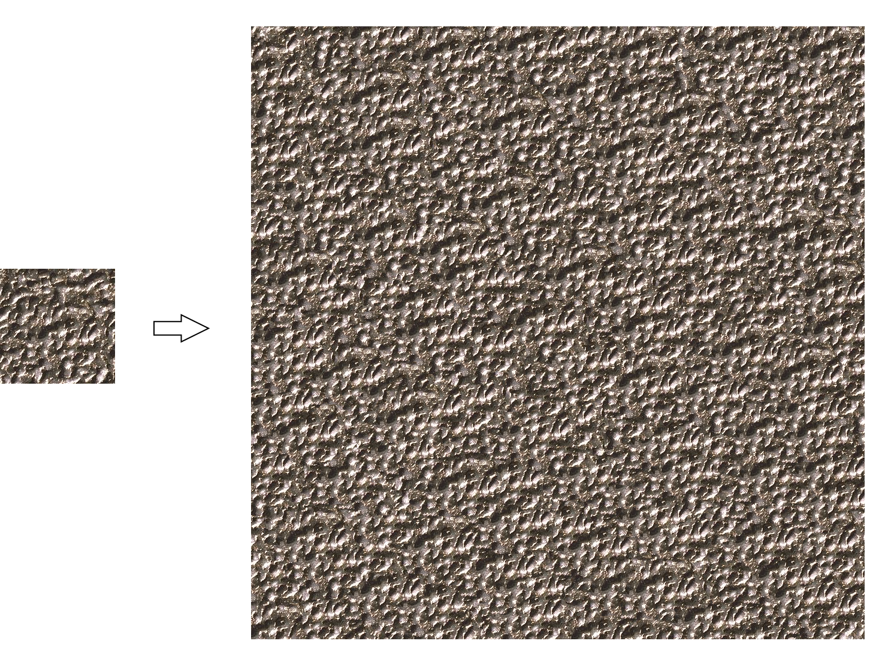

# GCTS

C++ implementation of example-based texture synthesis algo in [Graphcut Textures: Image and Video Synthesis Using Graph Cuts](https://www.cc.gatech.edu/~turk/my_papers/graph_cuts.pdf).

## Build

```shell
git clone --recursive https://github.com/AirGuanZ/GCTS.git
cd GCTS
mkdir build && cd build
cmake -DCMAKE_BUILD_TYPE=Release ..
```

## Run

```shell
./Synthesizer(.exe) --help
```

## Examples



```shell
./Synthesizer -i input.png -o output.png -w 1024 -h 1024
```

## TODOs

- [ ] More patch placement strategies

## Others

[C++ implementation of classical ImageQuilting algorithm](https://github.com/AirGuanZ/ImageQuilting)